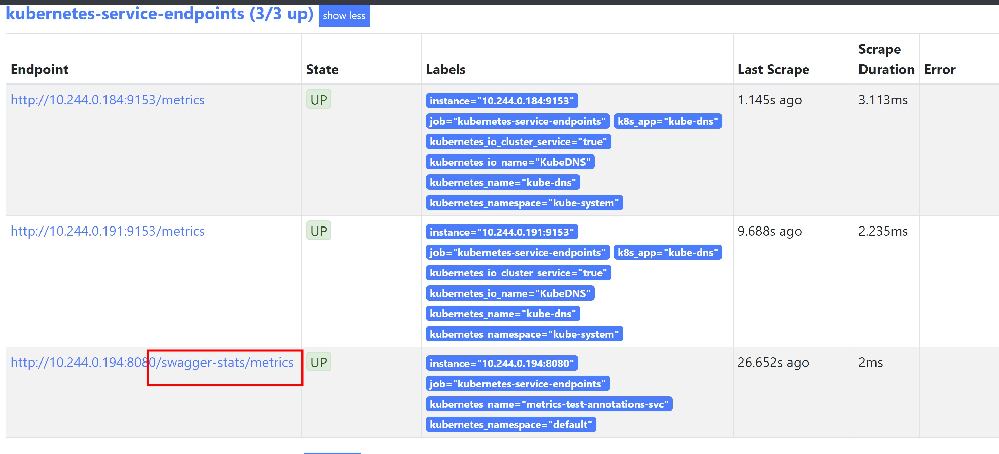

## 通过service添加注解自动采集数据

prometheus 采集数据两种方式

- 创建 `ServiceMonitor` 去监听 `Service`
- 在 `Service` 添加指定的注解，由 `Operotor` 自动寻找需要监听的 `Service`

创建 `ServiceMonitor` 的方式需要我们在创建每个service的时候都创建一个serviceMonitor，但是这样是非常不方便的。

operator 提供根据注解自动采集数据。


首先需要将配置生成一个 `secret`:

```shell script
kubectl create secret generic additional-configs --from-file=prometheus-additional.yaml -n monitoring
```

然后为 `Prometheus` 增加这个配置:

```shell script
...
securityContext:
    fsGroup: 2000
    runAsNonRoot: true
    runAsUser: 1000
additionalScrapeConfigs:
   name: additional-configs
   key: prometheus-additional.yaml
serviceAccountName: prometheus-k8s
serviceMonitorNamespaceSelector: {}
...
```
注意这里的name、key不要写错了，然后直接更新CRD:

```shell script
kubectl apply -f prometheus-prometheus.yaml
```

好了，之后在 service 添加以下注解就相当于创建 servicemonitor 了：

- prometheus.io/scrape: "true", 这个代表需要自动采集
- prometheus.io/port: 8080, 这个代表采集端口
- prometheus.io/path: "/metrics", 采集路径，默认是 metrics，可自定义。

但是如果仅仅是这样，在prometheus dashboard还无法看到target。因为rbac的权限没有给够，我们需要修改prometheus的 `ClusterRole`:

```yaml
apiVersion: rbac.authorization.k8s.io/v1
kind: ClusterRole
metadata:
  name: prometheus-k8s
rules:
  - apiGroups:
      - ""
    resources:
      - services
      - nodes
      - endpoints
      - pods
      - nodes/proxy
    verbs:
      - get
      - list
      - watch
  - apiGroups:
      - ""
    resources:
      - configmaps
      - nodes/metrics
    verbs:
    - get
  - nonResourceURLs:
      - /metrics
      - /swagger-stats/metrics
    verbs:
      - get
```

运行：

```shell script
kubectl apply -f prometheus-clusterRole.yaml
```

## 例子

[main.go](./main.go) 提供一个http服务，当请求路径为 '/swagger-stats/metrics' 会返回prometheus所需格式的数据。

首先编译成可执行文件：

```shell script
CGO_ENABLED=0 go build -o metrics main.go
```

然后打包成镜像:

```shell script
docker build -t registry.cn-shenzhen.aliyuncs.com/pdf/metrics:v2 .
```

部署这个 [deploy](deploy.yaml) ：

```shell script
kubectl apply -f deploy.yaml
```

编写 [service](metrics-test-annotions-svc.yaml), 注意这里的注解：

```yaml
annotations:
    prometheus.io/scrape: "true"
    prometheus.io/port: "8080"
    prometheus.io/path: "/swagger-stats/metrics"
```
这个注解指定采集端口为8080,请求路径为: /swagger-stats/metrics

部署service：

```shell script
kubectl apply -f metrics-test-annotions-svc.yaml
```

几分钟后，查看prometheus dashboard

